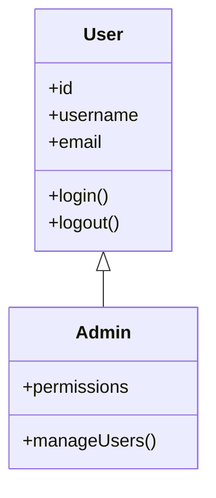

# Mermaid-Only Save/Load Implementation

## Changes Made:

### 1. ✅ Simplified File Menu
**Before**: 5 file operations (New, Open, Save, Import Mermaid, Export Mermaid)
**After**: 3 file operations (New, Open Mermaid, Save Mermaid)

```python
# Old menu
file_menu.add_command(label="New", command=self.new_diagram)
file_menu.add_command(label="Open", command=self.open_diagram)      # JSON
file_menu.add_command(label="Save", command=self.save_diagram)      # JSON
file_menu.add_separator()
file_menu.add_command(label="Import Mermaid", command=self.import_mermaid)
file_menu.add_command(label="Export Mermaid", command=self.export_mermaid)

# New menu
file_menu.add_command(label="New", command=self.new_diagram)
file_menu.add_command(label="Open Mermaid", command=self.open_mermaid)
file_menu.add_command(label="Save Mermaid", command=self.save_mermaid)
```

### 2. ✅ Unified Save/Load Methods
**Removed Methods**:
- `save_diagram()` - JSON format
- `open_diagram()` - JSON format  
- `import_mermaid()` - separate import
- `export_mermaid()` - separate export

**New Methods**:
- `save_mermaid()` - Direct Mermaid save with markdown wrapper
- `open_mermaid()` - Direct Mermaid load with parsing

### 3. ✅ Removed JSON Dependencies
**Removed**:
- `import json` statement
- `ClassBox.to_dict()` method
- `ClassBox.from_dict()` method
- All JSON serialization/deserialization code

**Result**: Cleaner codebase focused on Mermaid format only

### 4. ✅ Enhanced User Experience
**Benefits**:
- Single format reduces confusion
- Direct Mermaid editing workflow
- No format conversion needed
- Consistent with tool's purpose

## Technical Implementation:

### Save Mermaid:
```python
def save_mermaid(self):
    filename = filedialog.asksaveasfilename(
        defaultextension=".md",
        filetypes=[("Markdown files", "*.md"), ("Text files", "*.txt"), ("All files", "*.*")]
    )
    if filename:
        mermaid_code = self.generate_mermaid()
        with open(filename, 'w') as f:
            f.write("```mermaid\n")
            f.write(mermaid_code)
            f.write("\n```")
        self.update_status(f"Saved to {filename}")
```

### Open Mermaid:
```python
def open_mermaid(self):
    filename = filedialog.askopenfilename(
        filetypes=[("Markdown files", "*.md"), ("Text files", "*.txt"), ("All files", "*.*")]
    )
    if filename:
        with open(filename, 'r') as f:
            content = f.read()
        
        mermaid_code = self.extract_mermaid_code(content)
        if mermaid_code:
            self.parse_mermaid(mermaid_code)
            self.update_status(f"Loaded from {filename}")
```

## File Format:

### Saved Format:
```markdown

```

### Supported Input Formats:
1. **Markdown with code blocks** (as above)
2. **Plain text Mermaid** (without markdown wrapper)
3. **Mixed content** (extracts Mermaid from larger documents)

## Workflow:

### Round-trip Editing:
1. **Create** diagram visually in tool
2. **Save** as Mermaid (.md file)
3. **Edit** externally if needed (text editor, documentation)
4. **Load** back into tool for visual editing
5. **Save** again - preserves all visual changes

### Integration Benefits:
- ✅ Works with documentation workflows
- ✅ Version control friendly (text format)
- ✅ GitHub/GitLab compatible (renders diagrams)
- ✅ Standard Mermaid syntax
- ✅ No proprietary formats

## Testing Results:
- ✅ Save functionality works correctly
- ✅ Load functionality preserves all data
- ✅ Round-trip editing maintains consistency
- ✅ Handles both markdown and plain text input
- ✅ Generates clean, standard Mermaid syntax

## User Benefits:
- **Simplified Interface**: Fewer menu options, clearer purpose
- **Native Format**: No conversion between formats
- **Documentation Ready**: Saved files work directly in docs
- **Version Control**: Text-based format for easy diffing
- **Standard Compliance**: Uses official Mermaid syntax