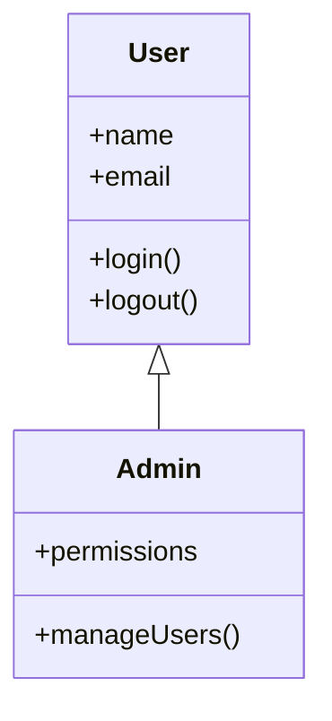

# Mermaid UML Class Diagram Tool

A visual drag-and-drop tool for creating UML class diagrams that exports to Mermaid format.

## Features

- **Visual Interface**: Drag and drop classes on a canvas workspace with improved spacing
- **Enhanced Class Editing**: Support for stereotypes, annotations, visibility modifiers, and notes
- **Advanced Relationships**: Six relationship types with labels and multiplicities
- **Auto-Selection**: New classes are automatically selected when created
- **Selectable Relationships**: Click relationship lines to select them, double-click to change type
- **Comprehensive UML Support**: Interfaces, abstract classes, dependencies, realizations
- **Mermaid Format**: Save and load diagrams directly in Mermaid format with full feature support
- **Visual Selection**: Clear selection indicators with red borders and corner handles
- **Status Bar**: Shows information about selected elements and available actions

## Usage

### Running the Tool
```bash
python mermaid_diagram_tool.py
```

### Sample Diagrams
- `sample_class_diagram.md`
- `sample_flowchart.md`
- `sample_sequence_diagram.md`
- `sample_state_diagram.md`
- `sample_er_diagram.md`

### Creating Classes
- Click "Add Class" button to create a new class (auto-selected)
- Right-click on canvas to create a class at that position (auto-selected)
- Double-click on a class to edit its name, attributes, and methods
- Drag classes around the canvas to position them
- New classes use improved spacing and positioning

### Adding Relationships
1. Select relationship type from dropdown (association, inheritance, composition, aggregation)
2. Click "Add Relationship" button
3. Click on the source class, then click on the target class
4. The relationship will be drawn with appropriate arrow/symbol

### Enhanced Class Features
- **Stereotypes**: Add `<<interface>>`, `<<abstract>>`, `<<utility>>` and custom stereotypes
- **Annotations**: Support for `@Override`, `@Deprecated`, `@Entity` and custom annotations
- **Visibility Modifiers**: `+` (public), `-` (private), `#` (protected), `~` (package)
- **Method Signatures**: Full parameter and return type support
- **Class Notes**: Add documentation notes that appear in the diagram
- **Visual Styling**: Different colors for interfaces (green), abstract classes (yellow)
- **Typography**: Abstract methods shown in italics, stereotypes in gray

### Advanced Relationships
- **Inheritance**: `--|>` Solid line with triangle (is-a relationship)
- **Realization**: `..|>` Dashed line with triangle (implements interface)
- **Association**: `-->` Solid line with arrow (uses/knows about)
- **Dependency**: `..>` Dashed line with arrow (temporary usage)
- **Composition**: `*--` Solid line with filled diamond (part-of, strong)
- **Aggregation**: `o--` Solid line with empty diamond (part-of, weak)
- **Labels**: Add descriptive text to relationships
- **Multiplicities**: Specify cardinality like `"1"`, `"0..*"`, `"1..*"`

### Editing Classes
- Double-click any class to open the edit dialog
- Modify class name, add/remove attributes and methods
- Use "Add Attribute/Method" buttons to add new items
- Select items in the list and use "Remove" buttons to delete them

### Importing Existing Diagrams
1. Use "File" → "Import Mermaid" to load existing Mermaid class diagrams
2. Supports both plain text files and markdown files with code blocks
3. Automatically parses classes, attributes, methods, and relationships
4. Classes are arranged in a grid layout for easy editing

The importer supports standard Mermaid syntax:

- **New**: Clear the current diagram
- **Open Mermaid**: Load existing Mermaid class diagrams from .md or .txt files
- **Save Mermaid**: Save diagram as Mermaid code in .md format

### Mermaid Integration
- **Native Format**: All save/load operations use Mermaid syntax directly
- **Markdown Support**: Automatically handles markdown code blocks
- **Round-trip Editing**: Load Mermaid diagrams, edit visually, save back to Mermaid
- **Standard Syntax**: Generates clean, standard Mermaid class diagram code

### Selection and Keyboard Shortcuts
- **Click**: Select a class (shows red border and corner indicators)
- **Right-click**: Create new class at cursor position
- **Delete key**: Remove selected classes or relationships
- **Escape key**: Deselect all classes and relationships, cancel relationship mode

## Mermaid Output

The tool generates standard Mermaid class diagram syntax:


## Relationship Types

- **Association** (-->): General relationship between classes
- **Inheritance** (<|--): "is-a" relationship with triangle arrow
- **Composition** (*--): "part-of" relationship with filled diamond
- **Aggregation** (o--): "has-a" relationship with empty diamond
