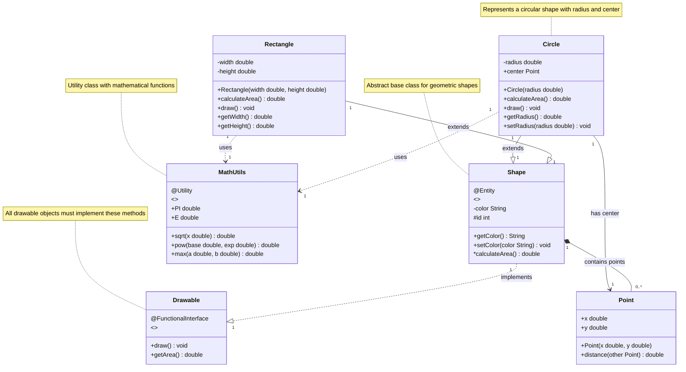

# Enhanced Mermaid UML Class Diagram Sample

This sample demonstrates all the enhanced UML features supported by the tool:

## Features Demonstrated:

### Class Features:
- **Stereotypes**: `<<interface>>`, `<<abstract>>`, `<<utility>>`
- **Annotations**: `@FunctionalInterface`, `@Entity`, `@Utility`
- **Visibility Modifiers**: `+` (public), `-` (private), `#` (protected)
- **Method Parameters**: `method(param Type) ReturnType`
- **Abstract Methods**: `*methodName()` (shown in italics)
- **Class Notes**: Attached documentation

### Relationship Features:
- **Inheritance**: `--|>` (solid line with triangle)
- **Realization**: `..|>` (dashed line with triangle)
- **Association**: `-->` (solid line with arrow)
- **Dependency**: `..>` (dashed line with arrow)
- **Composition**: `*--` (solid line with filled diamond)
- **Aggregation**: `o--` (solid line with empty diamond)
- **Multiplicities**: `"1"`, `"0..*"`, `"1..*"`
- **Labels**: `: extends`, `: implements`, `: uses`

### Visual Enhancements:
- **Color Coding**: Interfaces (green), Abstract classes (yellow), Concrete classes (blue)
- **Typography**: Abstract methods in italics, stereotypes in gray
- **Notes**: Orange text with emoji indicators
- **Enhanced Layout**: Proper spacing for complex class hierarchies