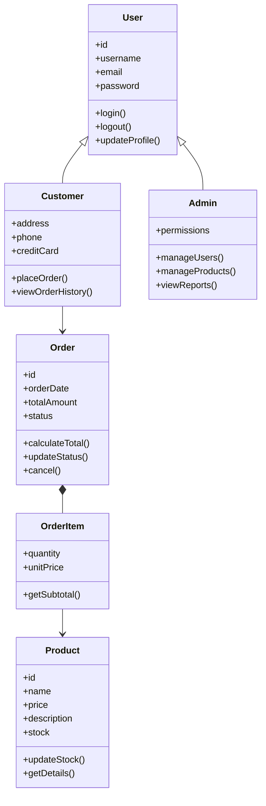

# Sample UML Class Diagram

This is a sample Mermaid class diagram showing a simple e-commerce system:

```mermaid
classDiagram
    class User {
        +id
        +username
        +email
        +password
        +login()
        +logout()
        +updateProfile()
    }
    
    class Customer {
        +address
        +phone
        +creditCard
        +placeOrder()
        +viewOrderHistory()
    }
    
    class Admin {
        +permissions
        +manageUsers()
        +manageProducts()
        +viewReports()
    }
    
    class Product {
        +id
        +name
        +price
        +description
        +stock
        +updateStock()
        +getDetails()
    }
    
    class Order {
        +id
        +orderDate
        +totalAmount
        +status
        +calculateTotal()
        +updateStatus()
        +cancel()
    }
    
    class OrderItem {
        +quantity
        +unitPrice
        +getSubtotal()
    }
    
    User <|-- Customer
    User <|-- Admin
    Customer --> Order
    Order *-- OrderItem
    OrderItem --> Product
```