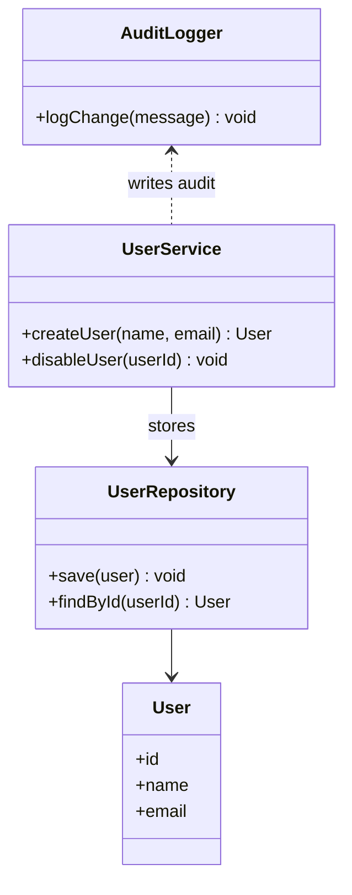

```mermaid
classDiagram
    class UserService {
        +createUser(name, email) User
        +disableUser(userId) void
    }
    class UserRepository {
        +save(user) void
        +findById(userId) User
    }
    class AuditLogger {
        +logChange(message) void
    }
    class User {
        +id
        +name
        +email
    }
    UserService --> UserRepository : stores
    AuditLogger <.. UserService : writes audit
    UserRepository --> User
```
