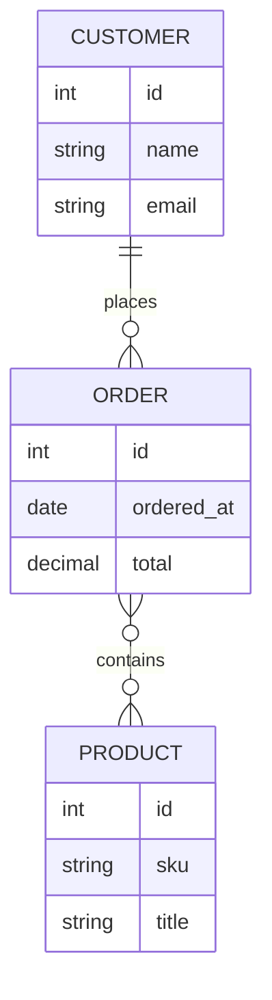

```mermaid
erDiagram
    CUSTOMER {
        int id
        string name
        string email
    }
    ORDER {
        int id
        date ordered_at
        decimal total
    }
    PRODUCT {
        int id
        string sku
        string title
    }
    CUSTOMER ||--o{ ORDER : places
    ORDER }o--o{ PRODUCT : contains
```
