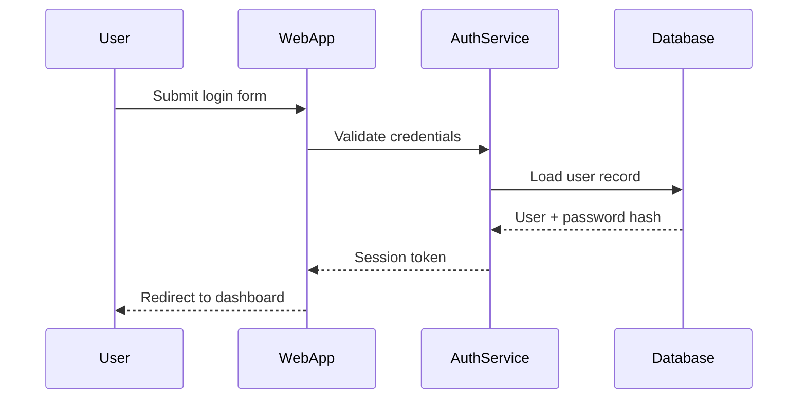

```mermaid
sequenceDiagram
    participant U as User
    participant W as WebApp
    participant A as AuthService
    participant D as Database
    U ->> W : Submit login form
    W ->> A : Validate credentials
    A ->> D : Load user record
    D -->> A : User + password hash
    A -->> W : Session token
    W -->> U : Redirect to dashboard
```
