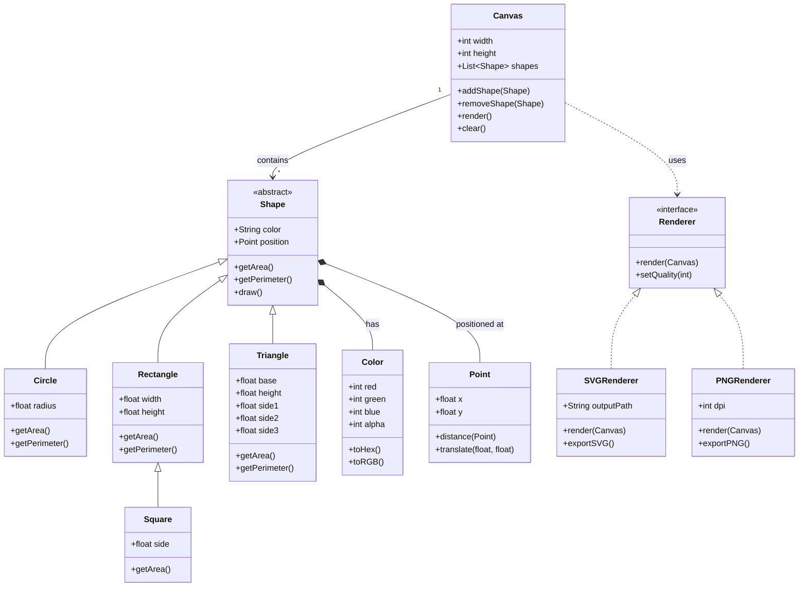

```mermaid
classDiagram
    class Shape {
        <<abstract>>
        +String color
        +Point position
        +getArea()
        +getPerimeter()
        +draw()
    }
    
    class Circle {
        +float radius
        +getArea()
        +getPerimeter()
    }
    
    class Rectangle {
        +float width
        +float height
        +getArea()
        +getPerimeter()
    }
    
    class Triangle {
        +float base
        +float height
        +float side1
        +float side2
        +float side3
        +getArea()
        +getPerimeter()
    }
    
    class Square {
        +float side
        +getArea()
    }
    
    Shape <|-- Circle
    Shape <|-- Rectangle
    Shape <|-- Triangle
    Rectangle <|-- Square
    
    class Canvas {
        +int width
        +int height
        +List~Shape~ shapes
        +addShape(Shape)
        +removeShape(Shape)
        +render()
        +clear()
    }
    
    class Color {
        +int red
        +int green
        +int blue
        +int alpha
        +toHex()
        +toRGB()
    }
    
    class Point {
        +float x
        +float y
        +distance(Point)
        +translate(float, float)
    }
    
    Canvas "1" --> "*" Shape : contains
    Shape *-- Color : has
    Shape *-- Point : positioned at
    
    class Renderer {
        <<interface>>
        +render(Canvas)
        +setQuality(int)
    }
    
    class SVGRenderer {
        +String outputPath
        +render(Canvas)
        +exportSVG()
    }
    
    class PNGRenderer {
        +int dpi
        +render(Canvas)
        +exportPNG()
    }
    
    Renderer <|.. SVGRenderer
    Renderer <|.. PNGRenderer
    Canvas ..> Renderer : uses
```
