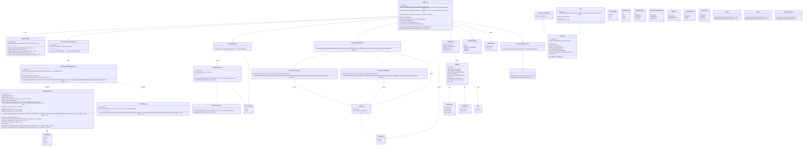

```mermaid
classDiagram
    class MapService {
        +__ Description __
        +Loops for each map layer and extracts height for a given lat lon
        +method of height extract is from predefined interpolation method use the max zoom and required pixel radius
        +If we can't extract the height for a layer move onto the next layer or if no suitable height was found then exit
        +point_interpolation_factory for the moment, will use bicubic interpolation
        +________________
        -validator: RequestValidator
        -map_source_type_factory: TileGenerationStrategyFactory
        -tile_factory: TileReaderFactory
        -crs_transformer: CrsTransformerInterface
        -point_interpolation_factory:PointInterpolationFactory
        +elevation_lookup(request: pb.MapRequest, ctx): pb.MapResponse
        -get_elevation_best_map(request: pb.MapRequest): float, string
    }
    class InterpolationType {
        +<<enumeration>>
        +NONE,
        +NEAREST_NEIGHBOUR,
        +BILINEAR,
        +BICUBIC
    }
    class TileReaderFactory {
        +create(tile_format: ElevationEncodingFormat): TileReaderInterface
    }
    class TileReaderInterface {
        +__ Description __
        +Translates a pixel patch into heights
        +_________________
        +<<interface>>
        +ConvertPixels(pixel_location: PixelCoordinate, tile: Tile) : ElevationPointCollection, bool
        -decode(pixel: PixelCoordinate, tile: Tile) : float
    }
    class ElevationPointCollection {
        +points: list~list~float~~
    }
    class TerrariumTileReader {
        +ConvertPixels(pixel_location: PixelCoordinate, tile: Tile) : ElevationPointCollection, bool
        -decode(pixel: PixelCoordinate, tile: Tile) : float
    }
    class CrsTransformerInterface {
        +<<interface>>
        +transformHeight(location_3d:Location3d, horizontal_datum_input: HorizontalDatum, vertical_datum_input: VerticalDatum, vertical_datum_output: VerticalDatum): Location3d
    }
    class PyProjCrsTransformer {
        +Description: Uses PyProj to convert the height to the required datum 'EGM2008'
        +transformHeight(location_3d:Location3d, horizontal_datum_input: HorizontalDatum, vertical_datum_input: VerticalDatum, vertical_datum_output: VerticalDatum): Location3d
    }
    class GeotransCrsTransformer {
        +Description: Uses Proj to convert the height to the required datum 'EGM2008'
        +transformHeight(location_3d:Location3d, horizontal_datum_input: HorizontalDatum, vertical_datum_input: VerticalDatum, vertical_datum_output: VerticalDatum): Location3d
    }
    class RequestValidator {
        +__ Description __
        +Validate the gRPC request and checks we have everything we need
        +_________________
        +Validate_request(request: pb.MapRequest, ctx): bool
        -require_fields(obj, fields: list~str~): bool
        -validate_ranges(obj, spec: dict~str, tuple~float,float~~): bool
        -_validate_maps(request: pb.MapRequest, ctx): bool
        -_validate_location_ranges(request: pb.MapRequest, validator): bool
    }
    class TileGenerationStrategyInterface {
        +___ Description ___
        +Interface for fetching pixel patches from different map sources e.g., SlippyMap, GeoTIFF.
        +___________________
        +<<interface>>
        +note "resolution length per data point"?
        +We need resolution zoom bounds to calculate which tiles to use.
        +create_tile(lat: float, lon: float, resolution: float, zoom_bounds: ZoomBounds,  pixel_radius: int =4, elevation_encoding_Type:Elevation_EncodingFormat, layer_url_template: str, auth: Auth?): Tile
    }
    class SlippyMapStategy {
        +___ Description ___
        +Loads a map made of tiles
        +Works out the tiles to get
        +Finds size of tiles "assumes all are the same size as each other"
        +Get pixel location in principal tile
        +Uses tile, pixel location and radius to get other tiles -> merge and crop to patch area.
        +Can validate pixels from transparency here when vallidating patch covers all the required pixels
        +Assumes we will using caching for reponses
        +___________________
        -MERCATOR_MAX_LAT: float = 85.05112878
        -MERCATOR_MIN_LAT: float = -85.05112878
        +create_tile(lat: float, lon: float, resolution: float, zoom_bounds: ZoomBounds,  pixel_radius: int =4, elevation_encoding_Type:Elevation_EncodingFormat, layer_url_template: str, auth: Auth?): Tile
        -resolution_to_zoom(resolution: float): int
        -get_tile_identifier_from_geodetic( zoom: int, lat_deg: float, lon_deg: float): TileIdentifier
        -format_tile_url(template: str, zoom: int, x: int, y: int): str
        -fetch_tile(url: str, auth: Auth?): (bytes, bool)
        -get_tile_size(): int
        -get_pixel_from_geodetic( tile_size: int, zoom: int, lat_deg: float, lon_deg: float):  int, px: float, py: float, ok: bool
        -create_tile_from_tiles(principle_tile_id:TileIdentifier, px: float, py: float , tile_size: int, radius: int) : Tile, bool
    }
    class TileIdentifier {
        +zoom: int
        +x: int
        +y: int
        +ok: bool
    }
    class GeoTiffStrategy {
        +___ Description ___
        +Loads a GeoTiff and returns the pixel patch that matches pixel location and radius.
        +___________________
        +create_tile(lat: float, lon: float, resolution: float, zoom_bounds: ZoomBounds,  pixel_radius: int =4, elevation_encoding_Type:Elevation_EncodingFormat, layer_url_template: str, auth: Auth?): Tile
    }
    class TileGenerationStrategyFactory {
        +___ Description ____
        +Decides how to handle a specific MapSourceType
        +________________
        +create(format: MapSourceType): TileGenerationStrategyInterface
    }
    class Tile {
        +__ Description __
        +Represents a patch of pixels centered on a given coordinate, including resolution and pixel position.
        +Stored in OpenCV2 format
        +______________
        +tile_bytes: opencv_image
    }
    class TileDetails {
        +___ Description ____
        +PixelCoords equals the query geodetic position
        +________________
        +resolution: float
        +pixel_xy: PixelCoordinate
        +geodetic_position:Location2d
        +vertical_datum: VerticalDatum
        +horizontal_datum: HorizontalDatum
        +elevation_encoding_type:ElevationEncodingFormat
        +valid_tile:bool
        +map_bounds() : MapBounds
    }
    class Location3d {
        +Height : float
        +vertical_datum : VerticalDatum
    }
    class PixelCoordinate {
        +x: float
        +y: float
    }
    class TileCoordinate {
        +zoom: int
        +x: int
        +y: int
    }
    class TilePixelFormat {
        +<<enumeration>>
        +RGB
        +RGBA
        +ARGB
    }
    class MapRequest {
        +location: Location2d
        +map_list: array ~MapItem~
        +vertical_datum: str
        +horizontal_datum: str
    }
    class Location2d {
        +lat: float
        +lon: float
    }
    class MapItem {
        +map_id: str
        +bounding_box: BoundingBox
        +zoom_bounds: ZoomBounds
        +map_source_type: MapSourceType
        +projection: Projection
        +tile_format: ElevationEncodingFormat
        +layer_url: str
        +vertical_datum: VerticalDatum
        +horizontal_datum: HorizontalDatum
        +auth: Auth
    }
    class BoundingBox {
        +min_lon: float
        +min_lat: float
        +max_lon: float
        +max_lat: float
    }
    class ZoomBounds {
        +min_zoom: int
        +max_zoom: int
    }
    class MapResponse {
        +map_id : string
        +height : float
    }
    class MapSourceType {
        +<<enumeration>>
        +UNKNOWN
        +SLIPPYMAP
        +GEOTIFF
    }
    class ElevationEncodingFormat {
        +<<enumeration>>
        +UNKNOWN
        +TERRARIUM
        +GRAYSCALE
    }
    class Projection {
        +<<enumeration>>
        +UNKNOWN
        +WEBMERCATOR
    }
    class HorizontalDatum {
        +<<enumeration>>
        +UNKNOWN
        +WGS84
    }
    class VerticalDatum {
        +<<enumeration>>
        +UNKNOWN
        +EGM2008
        +ELLIPSOID
    }
    class Auth {
        +none: str
    }
    class PointInterpolationFactory {
        +create(interpolation_method: InterpolationType) : PointInterpolationInterface
    }
    class n {
        +Interpolate(points: ElevationPointCollection) : float
        +Validate(points: ElevationPointCollection) : bool
    }
    class Bilinear {
        +Interpolate(points: ElevationPointCollection) : float
        +Validate(points: ElevationPointCollection) : bool
    }
    class Bicubic {
        +Interpolate(points: ElevationPointCollection):float
        +Validate(points: ElevationPointCollection):bool
    }
    class Nearest_Neighbour {
        +Interpolate(points: ElevationPointCollection)
        +Validate(points: ElevationPointCollection)
    }
    Location3d <.. Location2d
    MapService --> RequestValidator : uses
    MapService --> TileGenerationStrategyFactory
    MapService --> TileReaderFactory
    MapService --> CrsTransformerInterface
    MapService --> MapRequest
    MapService --> InterpolationType
    MapService --> MapResponse : returns
    MapService --> PointInterpolationFactory
    PointInterpolationFactory --> n
    MapRequest --> Location2d : location
    MapRequest "1" --> "*" MapItem : map_list
    TileGenerationStrategyFactory --> TileGenerationStrategyInterface : creates
    TileGenerationStrategyInterface <|.. SlippyMapStategy : realization
    TileGenerationStrategyInterface <|.. GeoTiffStrategy : realization
    SlippyMapStategy --> TileIdentifier : uses
    MapItem --> BoundingBox : has-a
    MapItem --> ZoomBounds : has-a
    MapItem --> Auth : has-a
    TileReaderFactory --> TileReaderInterface : creates
    TileReaderInterface <|.. TerrariumTileReader
    TileReaderFactory --> PixelCoordinate
    TileReaderInterface --> PixelCoordinate
    ElevationPointCollection <|-- TileDetails
    Tile <|-- TileDetails
    CrsTransformerInterface <|-- PyProjCrsTransformer
    CrsTransformerInterface <|.. GeotransCrsTransformer
    CrsTransformerInterface --> Location3d : returns
    PyProjCrsTransformer --> Location3d : returns
    GeotransCrsTransformer --> Location3d : returns
```