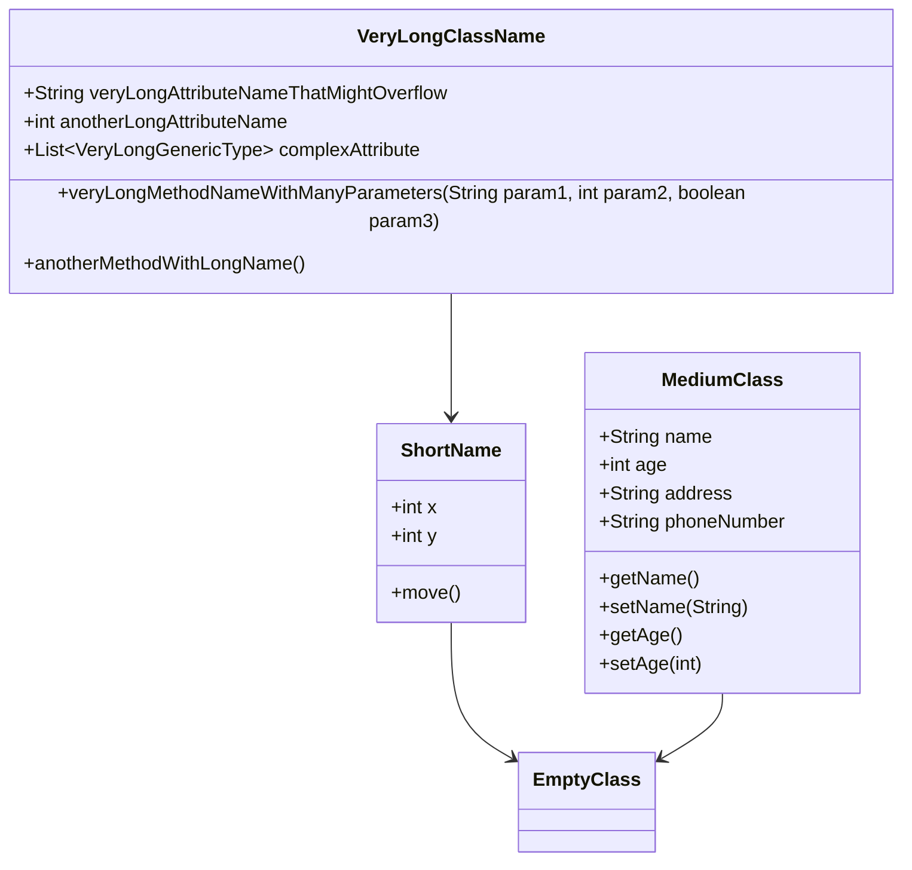

```mermaid
classDiagram
    class VeryLongClassName {
        +String veryLongAttributeNameThatMightOverflow
        +int anotherLongAttributeName
        +List~VeryLongGenericType~ complexAttribute
        +veryLongMethodNameWithManyParameters(String param1, int param2, boolean param3)
        +anotherMethodWithLongName()
    }
    
    class ShortName {
        +int x
        +int y
        +move()
    }
    
    class EmptyClass {
    }
    
    class MediumClass {
        +String name
        +int age
        +String address
        +String phoneNumber
        +getName()
        +setName(String)
        +getAge()
        +setAge(int)
    }
    
    VeryLongClassName --> ShortName
    ShortName --> EmptyClass
    MediumClass --> EmptyClass
```
