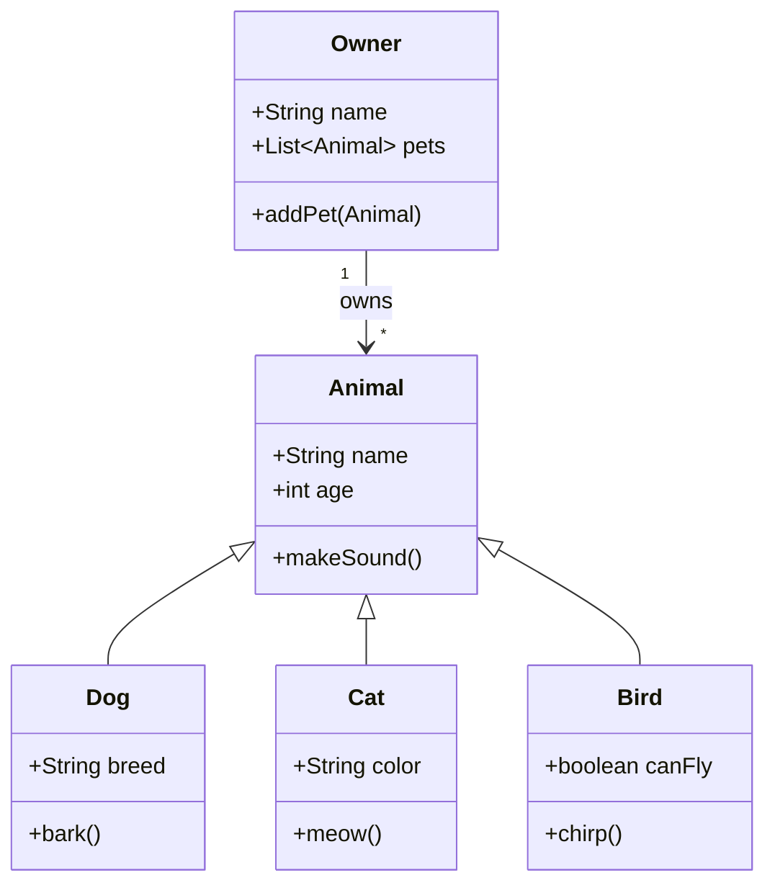

```mermaid
classDiagram
    class Animal {
        +String name
        +int age
        +makeSound()
    }
    
    class Dog {
        +String breed
        +bark()
    }
    
    class Cat {
        +String color
        +meow()
    }
    
    class Bird {
        +boolean canFly
        +chirp()
    }
    
    Animal <|-- Dog
    Animal <|-- Cat
    Animal <|-- Bird
    
    class Owner {
        +String name
        +List~Animal~ pets
        +addPet(Animal)
    }
    
    Owner "1" --> "*" Animal : owns
```
