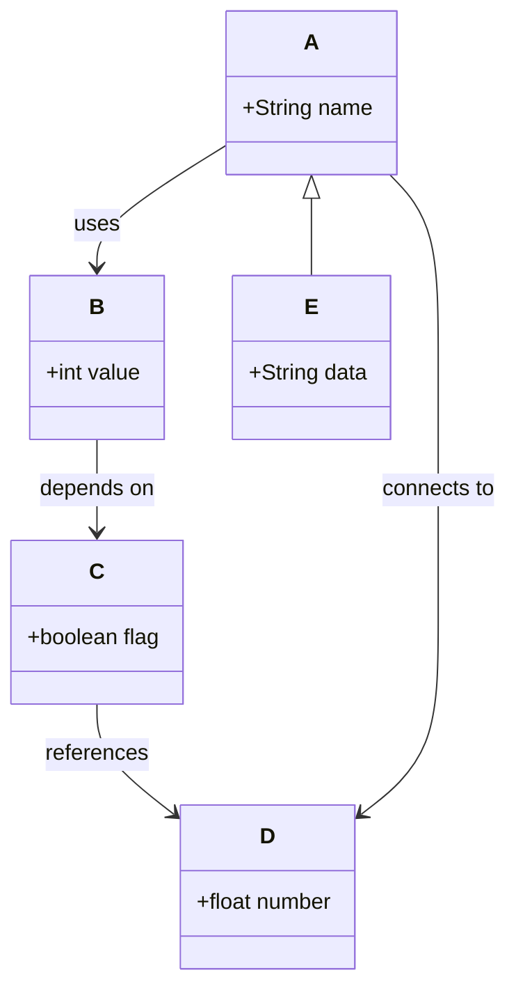

## Test Instructions

1. Open this file in the Mermaid Diagram Tool
2. Try clicking on the curved lines between classes
3. The line should turn red when selected
4. Status bar should show the relationship details
5. Double-click a line to change its type
6. Press Delete to remove a selected line
7. Press Escape to deselect

The curved lines should now be clickable anywhere along their path!
