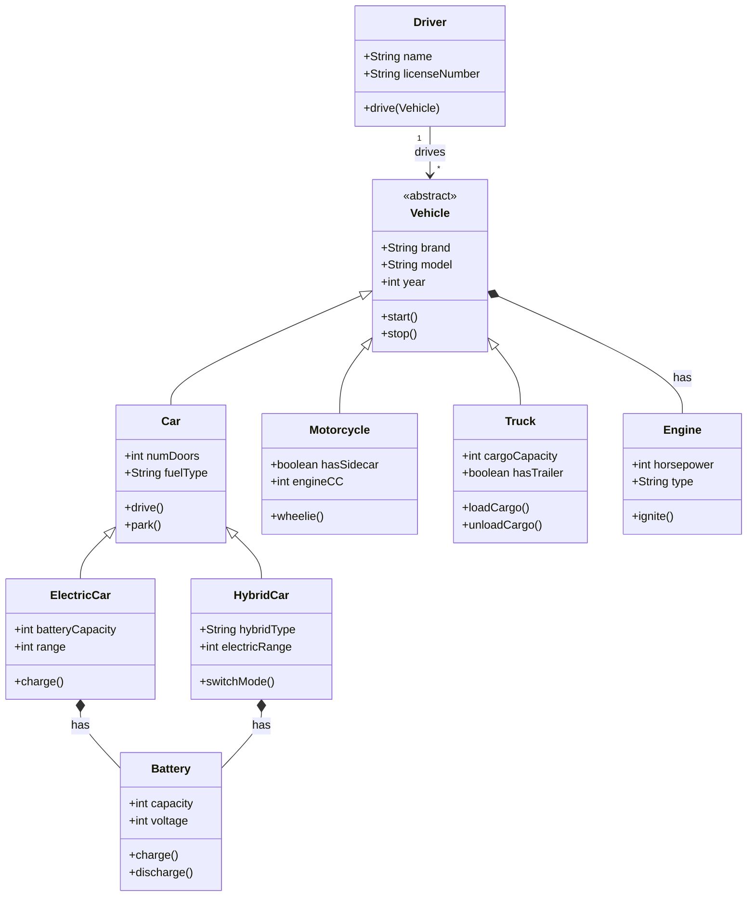

```mermaid
classDiagram
    class Vehicle {
        <<abstract>>
        +String brand
        +String model
        +int year
        +start()
        +stop()
    }
    
    class Car {
        +int numDoors
        +String fuelType
        +drive()
        +park()
    }
    
    class Motorcycle {
        +boolean hasSidecar
        +int engineCC
        +wheelie()
    }
    
    class Truck {
        +int cargoCapacity
        +boolean hasTrailer
        +loadCargo()
        +unloadCargo()
    }
    
    class ElectricCar {
        +int batteryCapacity
        +int range
        +charge()
    }
    
    class HybridCar {
        +String hybridType
        +int electricRange
        +switchMode()
    }
    
    Vehicle <|-- Car
    Vehicle <|-- Motorcycle
    Vehicle <|-- Truck
    Car <|-- ElectricCar
    Car <|-- HybridCar
    
    class Engine {
        +int horsepower
        +String type
        +ignite()
    }
    
    class Battery {
        +int capacity
        +int voltage
        +charge()
        +discharge()
    }
    
    Vehicle *-- Engine : has
    ElectricCar *-- Battery : has
    HybridCar *-- Battery : has
    
    class Driver {
        +String name
        +String licenseNumber
        +drive(Vehicle)
    }
    
    Driver "1" --> "*" Vehicle : drives
```
