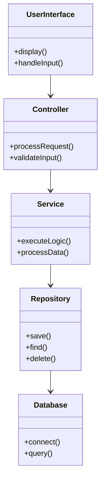

```mermaid
classDiagram
    class UserInterface {
        +display()
        +handleInput()
    }
    class Controller {
        +processRequest()
        +validateInput()
    }
    class Service {
        +executeLogic()
        +processData()
    }
    class Repository {
        +save()
        +find()
        +delete()
    }
    class Database {
        +connect()
        +query()
    }
    UserInterface --> Controller
    Controller --> Service
    Service --> Repository
    Repository --> Database
```