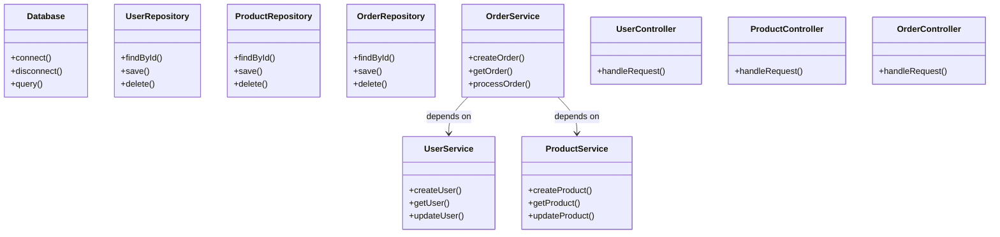

```mermaid
classDiagram
    class Database {
        +connect()
        +disconnect()
        +query()
    }
    class UserRepository {
        +findById()
        +save()
        +delete()
    }
    class ProductRepository {
        +findById()
        +save()
        +delete()
    }
    class OrderRepository {
        +findById()
        +save()
        +delete()
    }
    class UserService {
        +createUser()
        +getUser()
        +updateUser()
    }
    class ProductService {
        +createProduct()
        +getProduct()
        +updateProduct()
    }
    class OrderService {
        +createOrder()
        +getOrder()
        +processOrder()
    }
    class UserController {
        +handleRequest()
    }
    class ProductController {
        +handleRequest()
    }
    class OrderController {
        +handleRequest()
    }
    OrderService --> UserService : depends on
    OrderService --> ProductService : depends on
```