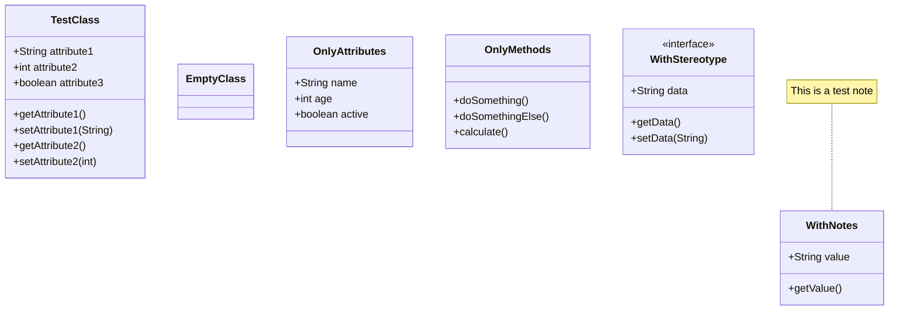

## Test Instructions

1. Open this file in the Mermaid Diagram Tool
2. Test at different zoom levels:
   - 50% (zoom out)
   - 100% (normal)
   - 150% (zoom in)
   - 200% (zoom in more)
3. Check that:
   - The black line separates class name from content
   - The gray line separates attributes from methods
   - The orange line separates methods from notes
   - All lines stay properly positioned at all zoom levels
   - Lines span the full width of the box

The separator lines should now scale correctly with zoom!
