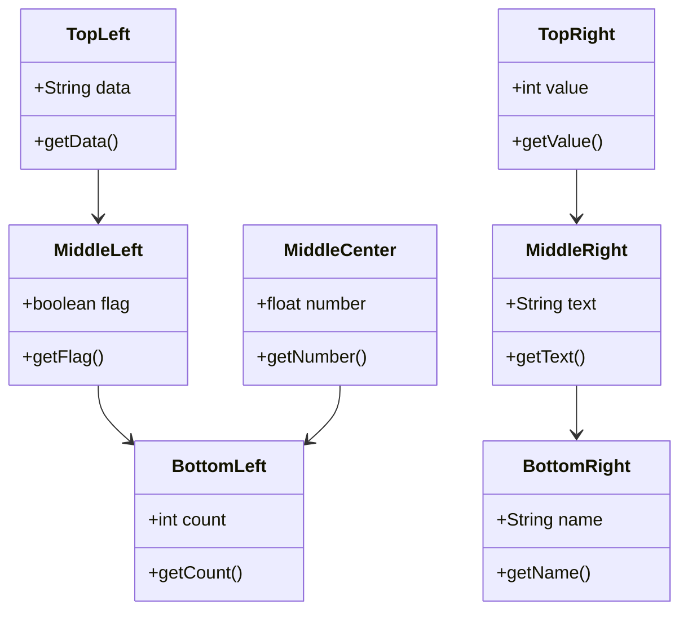

## Test Instructions

1. Open this file in the Mermaid Diagram Tool
2. Click "Auto Layout" to arrange the classes
3. Test selection at different zoom levels:

### At 100% Zoom (Normal):
- Click on each class - it should select correctly
- Right-click on empty space - should create new class at cursor
- Right-click on existing class - should NOT create new class

### At 50% Zoom (Zoomed Out):
- Click on each class - should select the CORRECT class
- Verify you're not selecting the wrong class
- Right-click should work correctly

### At 200% Zoom (Zoomed In):
- Click on each class - should select the CORRECT class
- Scroll around and test selection in different areas
- Right-click should create class at correct position

### Test Scrolling:
- Scroll the canvas to different positions
- Click on classes - should still select correctly
- The fix accounts for both zoom AND scroll position

## What Was Fixed

The click detection now uses `canvas.canvasx()` and `canvas.canvasy()` to convert event coordinates to canvas coordinates. This accounts for:
- Canvas scrolling (panning)
- Zoom level
- Viewport position

Before: Used raw event.x and event.y (wrong when zoomed/scrolled)
After: Uses canvas coordinates (correct at all zoom levels and scroll positions)
